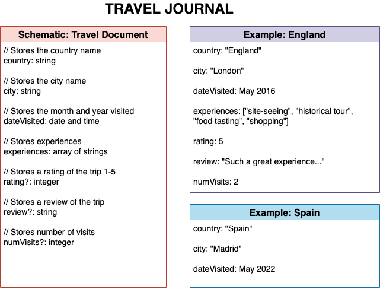
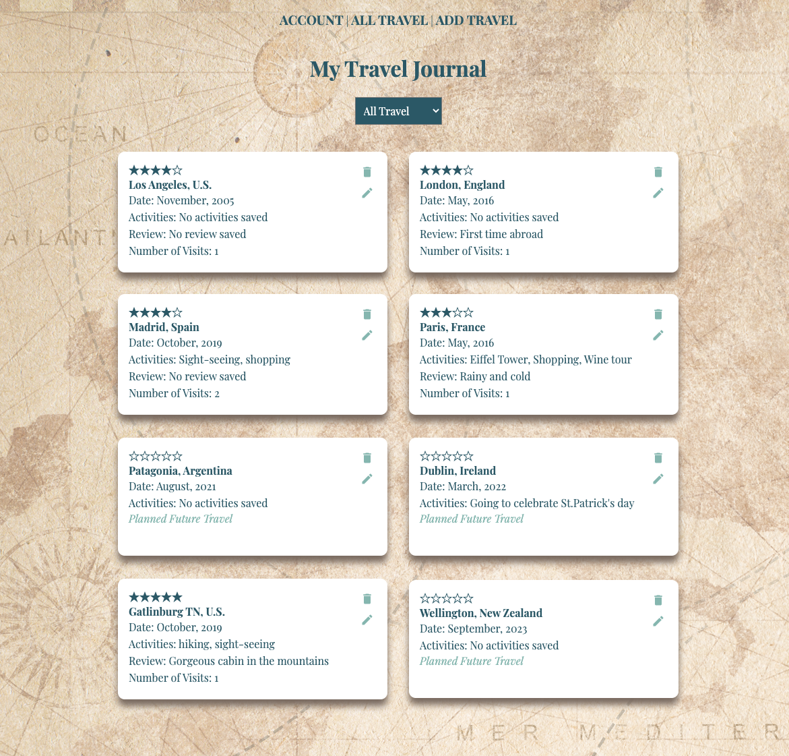

# code-sprint-c-final

## Travel Journal

The motivation for this app was to create a way to keep track of past and _future_ travel plans. I was fairly faithful to the origianl database sketch I created, below, but I did change the date to monthVisited and yearVisited.

**Current status:**

- I took what we learned re: the movie rating app and created user accounts in my database.
- I was able to get my array of "activities" to show with help from Vicki and Mike.
- I created a conditional checkbox for the user to input whether the travel happened in the past or is planned for the future.
- I created a filter to distinguish between all travel, past trips and future trips.
- I was able to adjust the styling for future trips and remove the "rating," "review," and "visits" from showing up.

**What remains to be done:**

- As a stretch goal I would like to add a calendar dropdown for the user to add the range of dates instead of manually entering just the month and year.
- I think it would be nice to also add a filter for location perhaps based on continents or just the U.S., etc.
- Ultimately I would love to push this project further and have the user be able to add images from their travel or even just include a picture of the location when they enter their travel.

